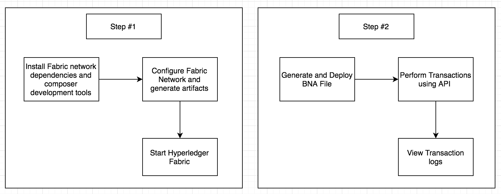

*阅读本文的其他语言版本：[English](README.md)。*
 # BlockchainNetwork-CompositeJourney

## 构建您的第一个网络 (BYFN)

欢迎来到构建区块链应用程序系列的第一部分。**第 1 部分**将介绍如何创建一个用于商品贸易的 Hyperledger Composer Business Network Archive (BNA) 文件，并将它部署在 Hyperledger Fabric 上。这是 Hyperledger Composer 样本中的最基础样本。

Hyperledger Fabric 是一种区块链架构实现，也是 The Linux Foundation 主办的一个 Hyperledger 项目。Hyperledger Fabric 旨在作为开发具有模块化架构的应用程序或解决方案的基础，它允许即插即用地使用共识服务和成员服务等组件。

[第 2 部分](https://github.com/IBM/BlockchainBalanceTransfer-CompositeJourney)，我们将进一步探索创建包含多个参与者的复杂网络，并使用访问控制规则 (ACL) 为参与者提供网络访问权限。在本 developer journey 中，将在本地运行 Hyperledger Fabric。

可以使用 [Hyperledger Composer](https://github.com/hyperledger/composer) 为当前的业务网络快速建模，包括现有资产和与之相关的交易。资产包括有形或无形的商品、服务或财产。作为业务网络模型的一部分，您还要定义能与资产交互的交易。业务网络还包含跨多个业务网络与它们交互的参与者，每个参与者都可以与唯一身份关联。业务网络定义由模型 (.cto)、脚本 (.js) 和 ACL (.acl) 文件组成，它们都打包为归档文件（.bna 文件）并导出。然后，将该归档文件部署到 Hyperledger Fabric 网络中。

## 包含的组件
* Hyperledger Fabric
* Hyperledger Composer
* Docker

## 应用程序工作流图


1.安装网络依赖项 a) cryptogen b) configtxgen c) configtxlator d) peer

2.配置网络 a) 生成网络工件 b) 启动网络

## 前提条件

* [Docker](https://www.docker.com/products/overview) - v1.13 或更高版本
* [Docker Compose](https://docs.docker.com/compose/overview/) - v1.8 或更高版本
* [Node.js & npm](https://nodejs.org/en/download/) - node v6.2.0 - v6.10.0（不支持 v7 及更高版本）；npm 是 Node 安装的一部分。
* [Git 客户端](https://git-scm.com/downloads) - 执行克隆命令时需要它
*  git - 2.9.x
*  Python - 2.7.x

## 步骤
1.[安装 Hyperledger Composer 开发工具](#1-installing-hyperledger-composer-development-tools)

2.[启动 Hyperledger Fabric](#2-starting-hyperledger-fabric)

3.[生成 Business Network Archive (BNA)](#3-generate-the-business-network-archive-bna)

4.[使用 Composer Playground 部署 Business Network Archive](#4-deploy-the-business-network-archive-using-composer-playground)

5.[将 Business Network Archive 部署到在本地运行的 Hyperledger Composer 上](#5-deploy-the-business-network-archive-on-hyperledger-composer-running-locally)

## 1.安装 Hyperledger Composer 开发工具

**备注：**您可能需要在超级用户 `sudo` 模式下运行这些命令。根据安全策略的规定，`sudo` 允许授权用户以超级用户或另一个用户的身份执行命令。

* `composer-cli` 包含用于开发业务网络的所有命令行操作。要安装 `composer-cli`，请运行以下命令：
```
npm install -g composer-cli
```

* `generator-hyperledger-composer` 是一个 Yeoman 插件，用于为您的业务网络创建定制的（也就是自定义的）应用程序。Yeoman 是一个开源客户端开发堆栈，包含帮助开发人员构建 Web 应用程序的工具和框架。要安装 `generator-hyperledger-composer`，请运行以下命令：
```
npm install -g generator-hyperledger-composer
```

* `composer-rest-server` 使用 Hyperledger Composer LoopBack Connector 连接到业务网络，提取模型，然后呈现一个页面，其中包含已经为该模型生成的 REST API。要安装 `composer-rest-server`，请运行以下命令：
```
npm install -g composer-rest-server
```

* 将 `Yeoman` 与 `generator-hyperledger-composer` 组件结合使用时，它可以解释业务网络并基于这些网络生成应用程序。要安装 `Yeoman`，请运行以下命令：
```
npm install -g yo
```

## 2.启动 Hyperledger Fabric

首先下载 Fabric 的 Docker 文件，为创建 Composer 配置文件做好准备。Hyperledger Composer 使用连接配置文件连接到运行时。连接配置文件是一个 JSON 文档，位于用户的主目录中（或者可能来自一个环境变量），在使用 Composer API 或命令行工具时，可以按名称引用它。使用连接配置文件确保代码和脚本能在运行时实例之间轻松移植。

使用以下命令启动 Fabric 并创建一个 Composer 配置文件：
```bash
./downloadFabric.sh
./startFabric.sh
./createComposerProfile.sh
```  

现在不需要这么做；但是作为参考，您可以使用以下命令停止并关闭 Fabric：
```
./stopFabric.sh
./teardownFabric.sh
```

## 3.生成 Business Network Archive (BNA)

这个业务网络定义了以下内容：

**参与者**
`贸易方`

**资产**
`商品`

**交易**
`贸易`

`商品`归一位`贸易方`所有，可通过提交`贸易`交易来修改`商品`的所有者。

下一步是为业务网络定义生成一个 Business Network Archive (BNA) 文件。BNA 文件是可部署的单元 - 一个可部署到 Composer 运行时上执行的文件。

使用以下命令生成网络归档文件：
```bash
npm install
```
您应该看到以下输出：
```bash
Creating Business Network Archive

Looking for package.json of Business Network Definition
	Input directory: /Users/ishan/Documents/git-demo/BlockchainNetwork-CompositeJourney

Found:
	Description: Sample Trade Network
	Name: my-network
	Identifier: my-network@0.0.1

Written Business Network Definition Archive file to
	Output file: ./dist/my-network.bna

Command succeeded
```

`composer archive create` 命令在 `dist` 文件夹中创建了一个名为 `my-network.bna` 的文件。

可以针对一个嵌入式运行时来测试业务网络定义，该运行时在一个 Node.js 进程中将“区块链”的状态存储在内存中。这个嵌入式运行时对单元测试非常有用，因为它使您能集中精力测试业务逻辑，而不是配置整个 Fabric。
从项目工作目录 (`BlockchainNetwork-CompositeJourney`)，运行以下命令：
```
npm test
```

您会看到以下输出：
```bash

> my-network@0.0.1 test /Users/laurabennett/2017-NewRole/Code/BlockchainNetwork-CompositeJourney
> mocha --recursive

Commodity Trading
    #tradeCommodity
      ✓ should be able to trade a commodity (198ms)


  1 passing (1s)
```

## 4.使用 Composer Playground 部署 Business Network Archive

打开 [Composer Playground](http://composer-playground.mybluemix.net/)，其中已在默认情况下导入基本样本网络。
如果以前使用过 Playground，一定要在浏览器控制台中运行 `localStorage.clear()` 来清除浏览器本地存储。

现在导入 `my-network.bna` 文件并单击 deploy 按钮。
<p align="center">
  
</p>

>也可以[在本地设置 Composer Playground](https://hyperledger.github.io/composer/installing/using-playground-locally.html)。

您会看到以下信息：
<p align="center">
  
</p>

要测试您的业务网络定义，请先单击 **Test** 选项卡：

单击 `Create New Participant` 按钮
<p align="center">
  
</p>


创建 `Trader` 参与者：

```
{
  "$class": "org.acme.mynetwork.Trader",
  "tradeId": "traderA",
  "firstName": "Tobias",
  "lastName": "Funke"
}

{
  "$class": "org.acme.mynetwork.Trader",
  "tradeId": "traderB",
  "firstName": "Simon",
  "lastName": "Stone"
}
```

突出显示最左侧的 Commodity 选项卡，
创建一个所有者为 `traderA` 的 `Commodity` 资产：
```
{
  "$class": "org.acme.mynetwork.Commodity",
  "tradingSymbol": "commodityA",
  "description": "Sample Commodity",
  "mainExchange": "Dollar",
  "quantity": 100,
  "owner": "resource:org.acme.mynetwork.Trader#traderA"
}
```

单击左下侧的 `Submit Transaction` 按钮，提交一个 `Trade` 交易来更改商品 `commodityA` 的所有者：
```
{
  "$class": "org.acme.mynetwork.Trade",
  "commodity": "resource:org.acme.mynetwork.Commodity#commodityA",
  "newOwner": "resource:org.acme.mynetwork.Trader#traderB"
}
```

可以单击 `Commodity` 注册表来验证新的所有者。也可以选择 `All Transactions` 注册表来查看所有交易。

交易视图示例：
<p align="center">
  
</p>

## 5.将 Business Network Archive 部署到在本地运行的 Hyperledger Composer 上（可选部署方法）

要将目录更改为包含 `my-network.bna` 文件的 `dist` 文件夹，请键入：
```
cd dist
composer network deploy -a my-network.bna -p hlfv1 -i PeerAdmin -s <randomString>
```

一段时间后，业务网络应该就会部署到本地 Hyperledger Fabric。您会看到以下输出：
```
Deploying business network from archive: my-network.bna
Business network definition:
	Identifier: my-network@0.0.1
	Description: Sample Trade Network

✔ Deploying business network definition.This may take a minute...


Command succeeded
```

可以键入以下命令来验证网络已部署：
```
composer network ping -n my-network -p hlfv1 -i admin -s adminpw
```

您会看到以下输出：
```
The connection to the network was successfully tested: my-network
	version: 0.10.0
	participant: <no participant found>

Command succeeded  
```

要与已部署的业务网络集成（创建资产/参与者并提交交易），可以使用 Composer Node SDK 或生成一个 REST API。
要创建 REST API，需要启动 `composer-rest-server`，告诉它如何连接到我们已部署的业务网络。
现在启动该服务器，方法是将目录更改到项目工作目录，并键入以下内容：
```bash
cd ..
composer-rest-server
```

回答启动时提出的问题。这些信息使 composer-rest-server 能连接到 Hyperledger Fabric，并配置如何生成 REST API。
```
_   _                                 _              _                                  ____                                                         
| | | |  _   _   _ __     ___   _ __  | |   ___    __| |   __ _    ___   _ __           / ___|   ___    _ __ ___    _ __     ___    ___    ___   _ __
| |_| | | | | | | '_ \   / _ \ | '__| | |  / _ \  / _` |  / _` |  / _ \ | '__|  _____  | |      / _ \  | '_ ` _ \  | '_ \   / _ \  / __|  / _ \ | '__|
|  _  | | |_| | | |_) | |  __/ | |    | | |  __/ | (_| | | (_| | |  __/ | |    |_____| | |___  | (_) | | | | | | | | |_) | | (_) | \__ \ |  __/ | |   
|_| |_|  \__, | | .__/   \___| |_|    |_|  \___|  \__,_|  \__, |  \___| |_|             \____|  \___/  |_| |_| |_| | .__/   \___/  |___/  \___| |_|   
         |___/  |_|                                       |___/                                                    |_|                                
? Enter your Fabric Connection Profile Name: hlfv1
? Enter your Business Network Identifier : my-network
? Enter your Fabric username : admin
? Enter your secret: adminpw
? Specify if you want namespaces in the generated REST API: never use namespaces
? Specify if you want the generated REST API to be secured: No
```

如果 composer-rest-server 成功启动，您会看到以下两行输出：
```
Web server listening at: http://localhost:3000
Browse your REST API at http://localhost:3000/explorer
```

打开 Web 浏览器并导航到 http://localhost:3000/explorer

您会看到 LoopBack API Explorer，可以检查和测试已生成的 REST API。按照上面的 Composer 部分给出的说明来测试业务网络定义。

## 准备执行第 2 步！
恭喜您 - 您已经完成这个系列学习之旅的第 1 步 - 请继续执行 [第 2 步](https://github.com/IBM/BlockchainBalanceTransfer-CompositeJourney).

## 其他资源
* [Hyperledger Fabric 文档](http://hyperledger-fabric.readthedocs.io/en/latest/)
* [Hyperledger Composer 文档](https://hyperledger.github.io/composer/introduction/introduction.html)

## 许可
[Apache 2.0](LICENSE)
