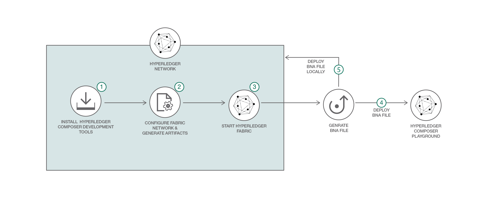
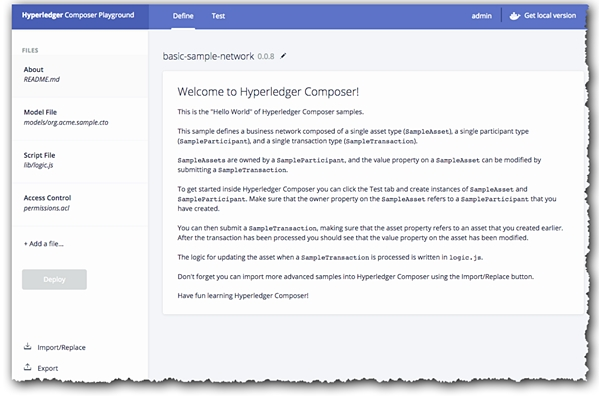
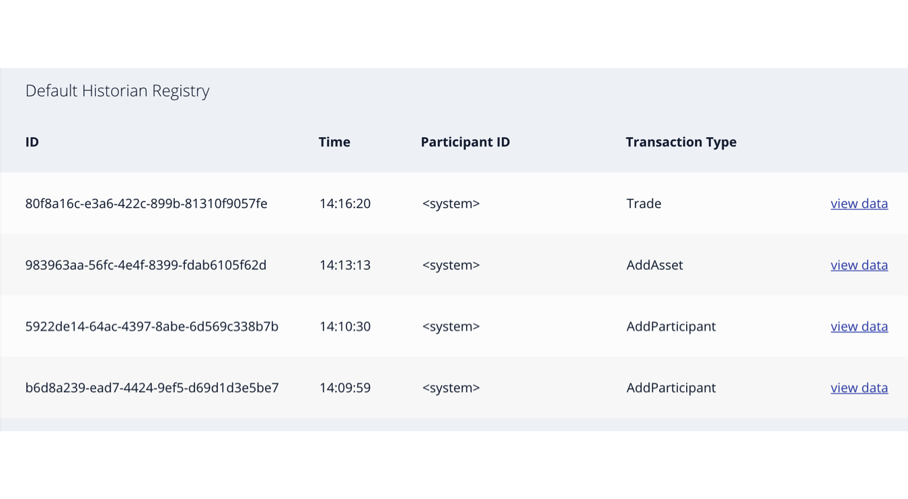

*Read this in other languages: [English](README.md), [한국어](README-ko.md).*
# BlockchainNetwork-CompositeJourney

## 初めてのネットワークを作成する (BYFN)

ブロックチェーン・アプリケーションを構築するシリーズの最初のコンテンツにようこそ。
**パート1** は、商品取引のための Hyperledger Composer ビジネスネットワークアーカイブ(BNA)ファイルを作成し、それを Hyperledger Fabric にデプロイする方法を示します。
これは管理経験のない開発初心者のための、Hyperledger Composer 版の "Hello World" サンプルというべきものです。
このパターンは、Hyperledger Composer V0.19.5、Hyperledger Fabric V1.1 をサポートするよう更新されました。

Hyperledger Fabric は、ブロックチェーン・フレームワークの実装であり、The Linux Foundation によってホストされている Hyperledger プロジェクトの1つです。
Hyperledger Fabric は、モジュラーアーキテクチャのアプリケーションやソリューションを開発するための基盤として、コンセンサスやメンバーシップサービスなどのコンポーネントをプラグアンドプレイでインストールできます。

[パート2](https://github.com/IBM/BlockchainBalanceTransfer-CompositeJourney) では、複数の参加者と複雑なネットワークを作成し、アクセス制御ルール(ACL)を使用してネットワークアクセス許可を与える方法について詳しく説明します。
このパターンでは、Hyperledger Fabric をローカルで実行します。

[Hyperledger Composer](https://github.com/hyperledger/composer) を使用すると、既存のアセットと関連するトランザクションを含む、現在のビジネスネットワークを迅速にモデル化することができます。
アセットは有形または無形の資産、サービスまたは権利です。
ビジネスネットワークモデルの一部として、資産に作用するトランザクションを定義します。
またビジネスネットワークには、複数のビジネスネットワークにわたって一意のIDをもち、それらネットワークに関与できる参加者が含まれます。
ビジネスネットワークの定義はモデル(.cto)、スクリプト(.js)、およびACL(.acl)ファイルで構成され、アーカイブ(.bnaファイル)としてパッケージ化されエクスポートされます。
アーカイブファイルは、Hyperledger Fabric ネットワークにデプロイされます。

## 含まれるコンポーネント
* Hyperledger Fabric
* Hyperledger Composer
* Docker

## アプリケーションのワークフロー図


1. ネットワーク構築に必要な以下のツールをインストールします。<br/>
	a) cryptogen<br/>
	b) configtxgen<br/>
	c) configtxlator<br/>
	d) peer
2. ネットワークを構築します。<br/>
	a) ネットワーク artifacts を生成する。<br/>
	b) ネットワークを起動する。
3. ビジネス・ネットワーク・アーカイブを生成します。
4. Composer Playground を使用してビジネス・ネットワーク・アーカイブをデプロイします。
5. (別の方法) ビジネス・ネットワーク・アーカイブを、ローカルで稼働中の Hyperledger Composer 上にデプロイします。

## 前提条件

Blockchain 用に Node をインストールする際には注意してください。
この [StackOverflow response](https://stackoverflow.com/questions/49744276/error-cannot-find-module-api-hyperledger-composer) を参照することをお勧めします。
なぜなら、間違った、もしくはComposerでサポートされていないバージョンの Node をインストールする間違いをよく見かけるからです。

* [Docker](https://www.docker.com/products/overview) - v1.13 以上
* [Docker Compose](https://docs.docker.com/compose/overview/) - v1.8 以上
* [NPM](https://www.npmjs.com/get-npm) - v5.6.0 以上
* [nvm](https://github.com/creationix/nvm) - v8.11.3
	* Node Version Manager
	* 使用するバージョンの Node をダウンロードおよび設定する
* [Node.js](https://nodejs.org/en/download/) - node v8.11.3
	* SUDO モードではインストールしない
* [Git client](https://git-scm.com/downloads) - v 2.9.x 以上
* [Python](https://www.python.org/downloads/) - 2.7.x

## 手順
1. [Hyperledger Composer 開発ツールをインストールする](#1-installing-hyperledger-composer-development-tools)
2. [Hyperledger Fabric を開始する](#2-starting-hyperledger-fabric)
3. [ビジネスネットワークアーカイブ (BNA) を生成する](#3-generate-the-business-network-archive-bna)
4. [Composer Playground を使ってビジネスネットワークアーカイブをデプロイする](#4-deploy-the-business-network-archive-using-composer-playground)
5. [ローカルの Hyperledger Composer にビジネスネットワークアーカイブを展開する](#5-deploy-the-business-network-archive-on-hyperledger-composer-running-locally)

<a name="1-installing-hyperledger-composer-development-tools"></a>
## 1. Hyperledger Composer 開発ツールをインストールする

**ノート:** スーパーユーザーの `sudo` モードでこれらのコマンドを実行する必要があるかもしれません。
`sudo` は、許可されたユーザがセキュリティポリシーによって、指定されたスーパーユーザまたは別のユーザとしてコマンドを実行できるようにします。
さらに、最新バージョンの composer-cli(0.19.5) をインストールします。
以前のバージョンがインストールされている場合は、次のコマンドを使用して削除します:

```
npm uninstall -g composer-cli
```

* `composer-cli` には、ビジネスネットワークを開発するためのコマンドライン操作がすべて含まれています。
`composer-cli` をインストールするには、以下のコマンドを実行します:
```
npm install -g composer-cli@0.19.5
```

* `generator-hyperledger-composer` は Yeoman プラグインで、ビジネスネットワーク用に特注の(カスタマイズされた)アプリケーションを作成します。
Yeoman は、オープンソースのクライアント側の開発スタックであり、開発者がWebアプリケーションを構築するのを支援するためのツールやフレームワークから構成されています。
`generator-hyperledger-composer` をインストールするには、以下のコマンドを実行します:
```
npm install -g generator-hyperledger-composer@0.19.5
```

* `composer-rest-server` は、Hyperledger Composer ループバックコネクタを使用してビジネスネットワークに接続し、モデルを抽出し、モデル用に生成された REST API を含むページを表示します。
`composer-rest-server`をインストールするには、以下のコマンドを実行します:
```
npm install -g composer-rest-server@0.19.5
```

* `Yeoman` と `generator-hyperledger-composer` コンポーネントを組み合わせると、ビジネス・ネットワークを解釈し、それに基づいたアプリケーションを生成することができます。
`Yeoman` をインストールするには、以下のコマンドを実行します:
```
npm install -g yo@2.0.0
```

<a name="2-starting-hyperledger-fabric"></a>
## 2. Hyperledger Fabric を開始する

Composer プロファイル作成の準備として、最初に Fabric の Docker ファイルをダウンロードします。
Hyperledger Composer は、接続プロファイルを使用してランタイムに接続します。
接続プロファイルは、ユーザーのホームディレクトリに存在する (または環境変数で指定される) JSONドキュメントであり、Composer API またはコマンドラインツールを使用するときに名前で参照されます。
接続プロファイルを使用することで、コードとスクリプトを1つのランタイムインスタンスから別のランタイムインスタンスに簡単に移植できます。

PeerAdmin カードは、ローカル Hyperbelger Fabric の管理に使用される特別なIDカードです。
例えばあなたのPCなど、開発環境にローカル Hyperbelger Fabric をインストールすると、PeerAdmin ID カードが作成されます。

Hyperledger Fabric v1.0ネットワーク用の PeerAdmin カードは PeerAdmin@hlfv1 形式です。
一般的に、PeerAdmin は次のような機能のために用意された特別な役割です:

* ビジネスネットワークをデプロイする
* ビジネスネットワーク管理者の ID カードの作成、発行、および取り消し

最初に、このリポジトリの内容をローカルにクローンし、プロジェクトフォルダにcdします:

```bash
git clone https://github.com/IBM/BlockchainNetwork-CompositeJourney.git

cd BlockchainNetwork-CompositeJourney
```

次に、Fabric を起動し、Composer プロファイルを作成します:
```bash
./downloadFabric.sh
./startFabric.sh
./createPeerAdminCard.sh
```  

今は実行する必要はありませんが、参考情報(FYI)として説明しておきます。
以下のように実行することで、ファブリックを停止して破棄することができます：
```
./stopFabric.sh
./teardownFabric.sh
```

<a name="3-generate-the-business-network-archive-bna"></a>
## 3. ビジネスネットワークアーカイブ (BNA) を生成する

このビジネスネットワークは、以下を規定します:

**参加者**
`トレーダー (Trader)`

**アセット**
`商品 (Commodity)`

**トランザクション**
`トレード (Trade)`

`商品` は `トレーダー` が所有し、`商品` のオーナーは `トレード` トランザクションを実施することで変更することができます。

次のステップでは、ビジネスネットワーク定義のビジネスネットワークアーカイブ (BNA) ファイルを生成します。
BNAファイルは、デプロイ可能なユニットで、実行のために Composer ランタイムに対してデプロイできるファイルです。

ネットワークアーカイブを生成するには、次のコマンドを使用します:
```bash
npm install
```
次の出力が表示されるでしょう:
```bash
Creating Business Network Archive

Looking for package.json of Business Network Definition
	Input directory: /Users/ishan/Documents/git-demo/BlockchainNetwork-CompositeJourney

Found:
	Description: Sample Trade Network
	Name: my-network
	Identifier: my-network@0.0.1

Written Business Network Definition Archive file to
	Output file: ./dist/my-network.bna

Command succeeded
```

`composer archive create` コマンドが `my-network.bna` ファイルを `dist` フォルダに作成しました。

Node.js プロセス内で、メモリ上に 'ブロックチェーン' の状態を格納する組み込みランタイムに対して、ビジネスネットワーク定義をテストできます。
この組み込みランタイムは Fabric 全体を構成する必要はなく、ビジネスロジックのテストに集中できるため、ユニットテストに非常に便利です。
プロジェクト作業ディレクトリ (`BlockchainNetwork-CompositeJourney`) から、次のコマンドでテストを実行します:

```
npm test
```

次の出力が表示されるでしょう:
```bash

> my-network@0.0.1 test /Users/laurabennett/2017-NewRole/Code/BlockchainNetwork-CompositeJourney
> mocha --recursive

Commodity Trading
    #tradeCommodity
      ✓ should be able to trade a commodity (198ms)


  1 passing (1s)
```

<a name="4-deploy-the-business-network-archive-using-composer-playground"></a>
## 4. Composer Playground を使ってビジネスネットワークアーカイブをデプロイする

[Composer Playground](http://composer-playground.mybluemix.net/) を開くと、デフォルトで Basic Sample Network がインポートされます。
以前プレイグランドを使用していた場合は、ブラウザのコンソールで `localStorage.clear()` を実行して、ブラウザのローカルストレージをクリアしてください。

次に、`my-network.bna` ファイルをインポートし、deployボタンをクリックします。
インポート方法がわからない場合は、[Composer Playground ツアー](https://www.youtube.com/watch?time_continue=29&v=JQMh_DQ6wXc) を参照してください。

> [ローカルの Composer Playground](https://hyperledger.github.io/composer/latest/installing/development-tools.html) を設定することもできます。

以下のように表示されるでしょう:
<p align="center">
  
</p>

ビジネスネットワーク定義をテストするには、まず **Test** タブをクリックしてください:

`Create New Participant` ボタンをクリックします:
<p align="center">
  
</p>


参加者 `Trader (トレーダー)` を作成します:

```
{
  "$class": "org.acme.mynetwork.Trader",
  "tradeId": "traderA",
  "firstName": "Tobias",
  "lastName": "Funke"
}
```
```
{
  "$class": "org.acme.mynetwork.Trader",
  "tradeId": "traderB",
  "firstName": "Simon",
  "lastName": "Stone"
}
```

左端の `Commodity (商品)` タブをハイライトし、
所有者を `traderA` とする `Commodity (商品)` 資産を作成します。
```
{
  "$class": "org.acme.mynetwork.Commodity",
  "tradingSymbol": "commodityA",
  "description": "Sample Commodity",
  "mainExchange": "Dollar",
  "quantity": 100,
  "owner": "resource:org.acme.mynetwork.Trader#traderA"
}
```

左下の `Submit Transaction` ボタンをクリックして、商品 `commodityA` の所有者を変更するための `Trade (トレード)` 取引を実施します:
```
{
  "$class": "org.acme.mynetwork.Trade",
  "commodity": "resource:org.acme.mynetwork.Commodity#commodityA",
  "newOwner": "resource:org.acme.mynetwork.Trader#traderB"
}
```

`Commodity (商品)` レジストリをクリックして、新しい所有者を確認することができます。
また、`All Transactions` レジストリを選択すると、すべてのトランザクションを見ることができます。

トランザクションビューの例:
<p align="center">
  
</p>

<a name="5-deploy-the-business-network-archive-on-hyperledger-composer-running-locally"></a>
## 5. ローカルの Hyperledger Composer にビジネスネットワークアーカイブを展開する (別のデプロイ方法)

Hyperledger Fabricにビジネスネットワークをデプロイするには、Hyperledger Composer チェーンコードをピアにインストールする必要があります。
その後、ビジネスネットワークアーカイブ (`.bna`) をピアに送信する必要があります。
新しい参加者と ID が関連したカードとして作成され、ネットワーク管理者になります。
次に、ネットワーク管理者のビジネスネットワークカードを使用するためにインポートする必要があります。
最後に、ネットワークが応答しているかどうかを確認するために ping を実行します。


ディレクトリを `my-network.bna` ファイルを含む` dist`フォルダに変更してください。

`composer network install` コマンドは、PeerAdmin ビジネスネットワークカード(今回は事前に作成してインポートしています) とビジネスネットワークの名前を必要とします。
composer ランタイムをインストールするには、次のコマンドを実行します:

```
cd dist
composer network install --card PeerAdmin@hlfv1 --archiveFile my-network.bna
```

`composer network start` コマンドにはビジネスネットワークカードだけでなく、ビジネスネットワークの管理者 ID の名前、`.bna` ファイルのパス、およびビジネスネットワークカードのインポート用に作成されるファイルの名前を指定します。
ビジネスネットワークをデプロイするには、次のコマンドを実行します:
```
composer network start --networkName my-network --networkVersion 0.0.1 --networkAdmin admin --networkAdminEnrollSecret adminpw --card PeerAdmin@hlfv1 --file networkadmin.card
```

`composer card import` コマンドは `composer network start` で指定されたファイル名を必要とします。
使用可能なビジネスネットワークカードとしてネットワーク管理者 ID をインポートするには、次のコマンドを実行します:
```
composer card import --file networkadmin.card
```

次のように入力して、ネットワークがデプロイされたことを確認できます:
```
composer network ping --card admin@my-network
```

次の出力が表示されるでしょう:
```
The connection to the network was successfully tested: my-network
	version: 0.19.0
	participant: org.hyperledger.composer.system.Identity#82c679fbcb1541eafeff1bc71edad4f2c980a0e17a5333a6a611124c2addf4ba

Command succeeded
```

デプロイされたビジネスネットワーク (アセット/参加者の作成とトランザクションの送信) と統合するには、Composer Node SDK を使用するか、REST API を生成できます。
REST APIを作成するには、`composer-rest-server` を起動し、デプロイされたビジネスネットワークに接続する方法を指定してください。
ディレクトリをプロジェクト作業ディレクトリに変更し、サーバを起動します:
```bash
cd ..
composer-rest-server
```

起動時に表示される質問に答えてください。
これにより、composer-rest-server は Hyperledger Fabric に接続し、REST API を利用可能にします。

* card name には `admin@my-network` と入力。
* 生成された API で名前空間を使用するかどうかを尋ねられたら `never namespace` を選択します。
* 生成された API を保護するかどうか尋ねられたら `No` を選択します。
* Passport 認証を有効にするかどうかを尋ねられたら `No` を選択します。
* イベントの公開を有効にするかどうか尋ねられたら `Yes` を選択します。
* TLS セキュリティを有効にするかどうか尋ねられたら `No` を選択します。

composer-rest-server が正常に起動した場合、次の (最後の) 2行が出力されるはずです:
```
Discovering types from business network definition ...
Discovered types from business network definition
Generating schemas for all types in business network definition ...
Generated schemas for all types in business network definition
Adding schemas for all types to Loopback ...
Added schemas for all types to Loopback
Web server listening at: http://localhost:3000
Browse your REST API at http://localhost:3000/explorer
```

Web ブラウザを起動し http://localhost:3000/explorer を開きます。

LoopBack API Explorer が表示され、生成された REST API を検査およびテストできます。
前の章で説明された手順に従って、ビジネスネットワーク定義をテストします。

## ステップ2に進む準備ができました！

おめでとうございます！
あなたはこのパターンのステップ1を完了しました。
[Step 2](https://github.com/IBM/BlockchainBalanceTransfer-CompositeJourney) に進んでください。

## 参考資料
* [Hyperledger Fabric Docs](http://hyperledger-fabric.readthedocs.io/en/latest/)

## ライセンス
[Apache 2.0](LICENSE)
