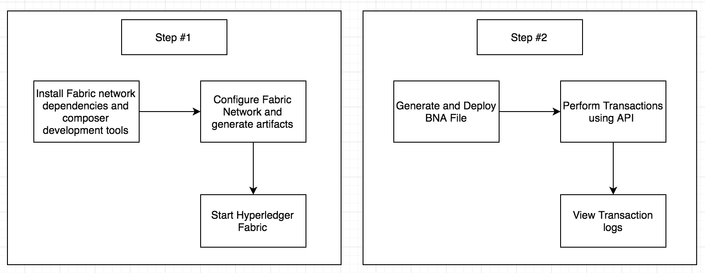
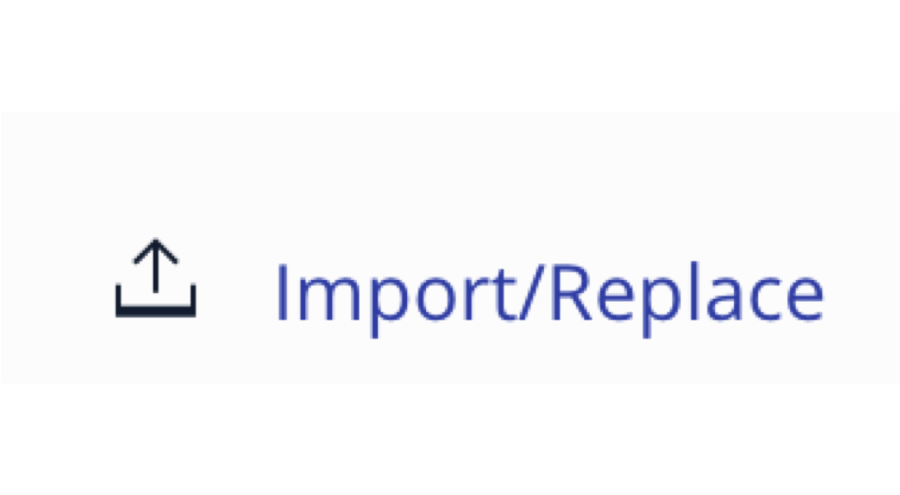

*Read this in other languages: [English](README.md), [中国](README-cn.md).*
# BlockchainNetwork-CompositeJourney

## Build Your First Network (BYFN)

블록체인 애플리케이션을 빌드하는 시리즈 중 첫 번째 과정에 오신 것을 환영합니다. **Part 1**에서는 상품 거래를 위한 하이퍼레저 컴포저 (Hyperledger Composer) BNA (Business Network Archive) 파일을 생성하여 하이퍼레저 패브릭 (Hyperledger Fabric)에 배포하는 방법을 보여줍니다. 이 과정은 하이퍼레저 컴포저 샘플버전의 "Hello World"입니다.

하이퍼레저 패브릭은 블록체인 런타임의 구현 프로젝트며, 리눅스 재단에서 호스팅하는 하이퍼레저 프로젝트 중 하나입니다. 모듈러 아키텍처로 애플리케이션이나 솔루션을 개발하기 위한 토대가 되는 하이퍼레저 패브릭은 합의 및 멤버십 서비스와 같은 구성 요소를 플러그 앤 플레이 방식으로 사용할 수 있습니다.

[Part 2](https://github.com/IBM/BlockchainBalanceTransfer-CompositeJourney)에서는 여러 참가자가 참여하는 복잡한 네트워크를 만들고 액세스 제어 리스트 (ACL)를 사용하여 네트워크 액세스 권한을 제공하는 방법에 대해 자세히 살펴봅니다. 이 과정에서는 하이퍼레저 패브릭을 로컬에서 실행합니다.

[하이퍼레저 컴포저](https://github.com/hyperledger/composer)를 사용하여 기존 자산과 이에 관련된 거래를 포함하는 현재의 비즈니스 네트워크를 신속하게 모델링할 수 있습니다. 자산은 유형 또는 무형의 재화, 서비스 또는 소유물입니다. 비즈니스 네트워크 모델의 한 부분인, 자산과 상호 작용할 수있는 트랜잭션을 정의합니다. 비즈니스 네트워크에 참여중인 참가자는 고유한 ID를 통해 여러 다른 비즈니스 네트워크에 참여할 수 있는 권한을 갖게 됩니다. 비즈니스 네트워크는 아카이브 (.bna 파일)로 패키지되고 export되는 모델 (.cto), 스크립트 (.js) 및 ACL (.acl) 파일로 구성됩니다. 그런 다음 아카이브 파일이 하이퍼레저 패브릭 네트워크에 배포됩니다.

## 구성 요소
* 하이퍼레저 패브릭
* 하이퍼레저 컴포저
* 도커 (Docker)

## 애플리케이션 워크플로우 다이아그램


1. 네트워크 구성파일 설치하기 a) cryptogen b) configtxgen c) configtxlator d) peer
2. 네트워크 설정하기 a) generating the network artifacts b) 네트워크 시작하기

## 사전 준비

* [Docker](https://www.docker.com/products/overview) - v1.13 또는 그 이상
* [Docker Compose](https://docs.docker.com/compose/overview/) - v1.8 또는 그 이상
* [Node.js & npm](https://nodejs.org/en/download/) - node v6.2.0 - v6.10.0 (v7+ 미지원); npm은 노드 설치와 동시에 제공됩니다.
* [Git client](https://git-scm.com/downloads) - clone 명령 관련하여 필요합니다
*  git - 2.9.x
*  Python - 2.7.x

## Steps
1. [하이퍼레저 컴포저 개발 툴 설치하기](#1-하이퍼레저-컴포저-개발-툴-설치하기)
2. [하이퍼레저 패브릭 시작하기](#2-하이퍼레저-패브릭-시작하기)
3. [Business Network Archive (BNA) 생성하기](#3-business-network-archive-bna-)
4. [Composer Playground를 사용하여 Business Network Archive 배포하기](#4-composer-playground를-사용하여-business-network-archive-배포하기)
5. [로컬에 있는 하이퍼레저 컴포저에 Business Network Archive 배포하기](#5-로컬에-있는-하이퍼레저-컴포저에-business-network-archive-배포하기)

## 1. 하이퍼레저 컴포저 개발 툴 설치하기

**주의:** 수퍼유저 `sudo`모드에서 이 명령을 실행해야 할 수 있습니다. `sudo`를 사용하면 허용된 사용자가 보안 정책에 지정된대로 수퍼유저 또는 다른 사용자로 명령을 실행할 수 있습니다.

* `composer-cli` 에는 비즈니스 네트워크 개발에 대한 모든 명령어를 가지고 있습니다. `composer-cli` 를 설치하려면 아래 명령어를 실행하십시오:
```
npm install -g composer-cli@0.16.0
```

* `generator-hyperledger-composer`는 Yeoman 플러그인으로 비즈니스 네트워크용 애플리케이션을 맞춤 제작합니다. Yeoman은 오픈 소스 클라이언트 측 개발 스택으로, 개발자가 웹 애플리케이션을 작성하는데 도움이 되는 툴과 프레임워크로 구성됩니다. `generator-hyperledger-composer`를 설치하려면 아래 명령어를 실행하십시오:
```
npm install -g generator-hyperledger-composer@0.16.0
```

* `composer-rest-server`는 하이퍼레저 컴포저 루프백 커넥터를 사용하여 비즈니스 네트워크에 연결하고 모델을 추출한 다음, 모델용으로 생성된 REST API가 포함된 페이지를 보여줍니다. `composer-rest-server`를 설치하려면 아래 명령어를 실행하십시오:
```
npm install -g composer-rest-server@0.16.0
```

* `Yeoman`을  `generator-hyperledger-composer` 구성 요소와 결합하면, 비즈니스 네트워크를 해석하고 이를 기반으로 애플리케이션을 생성할 수 있습니다. `Yeoman`을 설치하려면 아래 명령어를 실행하십시오:
```
npm install -g yo@2.0.0
```

## 2. 하이퍼레저 패브릭 

First download the docker files for Fabric in preparation for creating a Composer profile.  Hyperledger Composer uses Connection Profiles to connect to a runtime. A Connection Profile is a JSON document that lives in the user's home directory (or may come from an environment variable) and is referenced by name when using the Composer APIs or the Command Line tools. Using connection profiles ensures that code and scripts are easily portable from one runtime instance to another.

Start the Fabric and create a Composer profile using the following commands:
```bash
./downloadFabric.sh
./startFabric.sh
./createPeerAdminCard.sh
```  

No need to do it now; however as an fyi - you can stop and tear down Fabric using:
```
./stopFabric.sh
./teardownFabric.sh
```

## 3. Business Network Archive (BNA) 생성하기

This business network defines:

**Participant**
`Trader`

**Asset**
`Commodity`

**Transaction**
`Trade`

`Commodity` is owned by a `Trader`, and the owner of a `Commodity` can be modified by submitting a `Trade` transaction.

The next step is to generate a Business Network Archive (BNA) file for your business network definition. The BNA file is the deployable unit -- a file that can be deployed to the Composer runtime for execution.

Use the following command to generate the network archive:
```bash
npm install
```
You should see the following output:
```bash
Creating Business Network Archive

Looking for package.json of Business Network Definition
	Input directory: /Users/ishan/Documents/git-demo/BlockchainNetwork-CompositeJourney

Found:
	Description: Sample Trade Network
	Name: my-network
	Identifier: my-network@0.0.1

Written Business Network Definition Archive file to
	Output file: ./dist/my-network.bna

Command succeeded
```

The `composer archive create` command has created a file called `my-network.bna` in the `dist` folder.

You can test the business network definition against the embedded runtime that stores the state of 'the blockchain' in-memory in a Node.js process. This embedded runtime is very useful for unit testing, as it allows you to focus on testing the business logic rather than configuring an entire Fabric.
From your project working directory(`BlockchainNetwork-CompositeJourney`), run the command:
```
npm test
```

You should see the following output:
```bash

> my-network@0.0.1 test /Users/laurabennett/2017-NewRole/Code/BlockchainNetwork-CompositeJourney
> mocha --recursive

Commodity Trading
    #tradeCommodity
      ✓ should be able to trade a commodity (198ms)


  1 passing (1s)
```

## 4. Composer Playground를 사용하여 Business Network Archive 배포하기

Open [Composer Playground](http://composer-playground.mybluemix.net/), by default the Basic Sample Network is imported.
If you have previously used Playground, be sure to clear your browser local storage by running `localStorage.clear()` in your browser Console.

Now import the `my-network.bna` file and click on deploy button.
<p align="center">
  
</p>

>You can also setup [Composer Playground locally](https://hyperledger.github.io/composer/installing/using-playground-locally.html).

You will see the following:
<p align="center">
  
</p>

To test your Business Network Definition, first click on the **Test** tab:

Click on the `Create New Participant` button
<p align="center">
  
</p>


Create `Trader` participants:

```
{
  "$class": "org.acme.mynetwork.Trader",
  "tradeId": "traderA",
  "firstName": "Tobias",
  "lastName": "Funke"
}
```
```
{
  "$class": "org.acme.mynetwork.Trader",
  "tradeId": "traderB",
  "firstName": "Simon",
  "lastName": "Stone"
}
```

Highlight the Commodity tab on the far left hand side and
create a `Commodity` asset with owner as `traderA`:
```
{
  "$class": "org.acme.mynetwork.Commodity",
  "tradingSymbol": "commodityA",
  "description": "Sample Commodity",
  "mainExchange": "Dollar",
  "quantity": 100,
  "owner": "resource:org.acme.mynetwork.Trader#traderA"
}
```

Click on the `Submit Transaction` button on the lower left-hand side and submit a `Trade` transaction to change the owner of Commodity `commodityA`:
```
{
  "$class": "org.acme.mynetwork.Trade",
  "commodity": "resource:org.acme.mynetwork.Commodity#commodityA",
  "newOwner": "resource:org.acme.mynetwork.Trader#traderB"
}
```

You can verify the new owner by clicking on the `Commodity` registry. Also you can view all the transactions by selecting the `All Transactions` registry.

Example of transaction view:
<p align="center">
  
</p>

## 5. 로컬에 있는 하이퍼레저 컴포저에 Business Network Archive 배포하기 (대체 설치 방안)

Deploying a business network to the Hyperledger Fabric requires the Hyperledger Composer chaincode to be installed on the peer, then the business network archive (.bna) must be sent to the peer, and a new participant, identity, and associated card must be created to be the network administrator. Finally, the network administrator business network card must be imported for use, and the network can then be pinged to check it is responding.

Change directory to the `dist` folder containing `my-network.bna` file.

The `composer runtime install` command requires a PeerAdmin business network card (in this case one has been created and imported in advance), and the name of the business network. To install the composer runtime, run the following command:
```
cd dist
composer runtime install --card PeerAdmin@hlfv1 --businessNetworkName my-network
```

The `composer network start` command requires a business network card, as well as the name of the admin identity for the business network, the file path of the `.bna` and the name of the file to be created ready to import as a business network card. To deploy the business network, run the following command:
```
composer network start --card PeerAdmin@hlfv1 --networkAdmin admin --networkAdminEnrollSecret adminpw --archiveFile my-network.bna --file networkadmin.card
```

The `composer card import` command requires the filename specified in `composer network start` to create a card. To import the network administrator identity as a usable business network card, run the following command:
```
composer card import --file networkadmin.card
```

You can verify that the network has been deployed by typing:
```
composer network ping --card admin@my-network
```

You should see the the output as follows:
```
The connection to the network was successfully tested: my-network
	version: 0.16.0
	participant: org.hyperledger.composer.system.NetworkAdmin#admin

Command succeeded
```

To integrate with the deployed business network (creating assets/participants and submitting transactions) we can either use the Composer Node SDK or we can generate a REST API. To create the REST API we need to launch the `composer-rest-server` and tell it how to connect to our deployed business network. Now launch the server by changing directory to the project working directory and type:
```bash
cd ..
composer-rest-server
```

Answer the questions posed at startup. These allow the composer-rest-server to connect to Hyperledger Fabric and configure how the REST API is generated.
* Enter `admin@my-network` as the card name.
* Select `never use namespaces` when asked whether to use namespaces in the generated API.
* Select `No` when asked whether to secure the generated API.
* Select `Yes` when asked whether to enable event publication.
* Select `No` when asked whether to enable TLS security.

If the composer-rest-server started successfully you should see these two lines are output:
```
Web server listening at: http://localhost:3000
Browse your REST API at http://localhost:3000/explorer
```

Open a web browser and navigate to http://localhost:3000/explorer

You should see the LoopBack API Explorer, allowing you to inspect and test the generated REST API. Follow the instructions to test Business Network Definition as mentioned above in the composer section.

## Ready to move to Step 2!
Congratulations - you have completed Step 1 of this Composite Journey - move onto [Step 2](https://github.com/IBM/BlockchainBalanceTransfer-CompositeJourney).

## Additional Resources
* [Hyperledger Fabric Docs](http://hyperledger-fabric.readthedocs.io/en/latest/)
* [Hyperledger Composer Docs](https://hyperledger.github.io/composer/introduction/introduction.html)

## License
[Apache 2.0](LICENSE)
